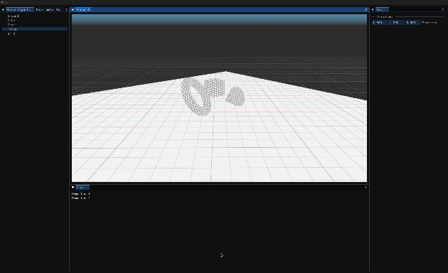

# Meow Engine
<b>A journey to physics simulations!</b>

> [!CAUTION]
> #### Build Status (non-compilable)
> Implementing multi-threading which involves `main, render and physics thread` to
> handle different game states (produced & consumed).
> This involves decoupling the root engine code base and since it's still ongoing,
> currently build is not possible.

- Meow Engine is a personal exploration into the world of physics engine development
- Focuses on:
  - Multithreading for optimized performance.
  - Profiling tools for debugging and performance tracking.
  - Editor tools
  - Physics simulations
  - [Next plan of action...](markdowns/plan_of_action.md)

The ultimate goal of Meow Engine is to delve deep into the 
complexities of physics simulations and engine design,
providing a unique opportunity to learn and experiment 
with modern technologies and architectural concepts.

## Demo [(web v0.3 build)](http://wulcat.com/physicat/index.html)

## Compatibility 
- [x] Unix Console on Mac
- [x] Mac (x84) (Rosetta)
- [ ] Windows
- [x] Web

> [!NOTE]
> Currently `PhysX` is non-compilable for web. `Web builds` are on halt.
> Will be revisiting once multithreading is implemented.

## Building & docs 
- [Compile Meow Engine](markdowns/how_to_build.md)
- [Build documentation](markdowns/how_to_build.md)
- [See Versions](markdowns/versions.md)
- Downloads (not available)

## Dependencies [(full list)](markdowns/dependencies.md)
- [OpenGL ES3](https://www.opengl.org)
- [SDL2](https://www.libsdl.org/release)
-  [SDL2 Image v2.0.4](https://www.libsdl.org/projects/SDL_image)
- [Tiny obj loader v1.0.6](https://github.com/tinyobjloader/tinyobjloader)
- [Imgui v1.90.9-docking](https://github.com/ocornut/imgui)
- [Tracy Profiler v0.10](https://github.com/wolfpld/tracy)
- [NVIDIA PhysX 5.0](https://github.com/NVIDIA-Omniverse/PhysX)
- [Entt v3.13.2](https://github.com/skypjack/entt)
- [ConcurrentQueue v1.0.4 by ](https://github.com/cameron314/concurrentqueue)
- DOxygen
- Homebrew
- Ninja
- CMake
- Mac Specific
  - SDL 2 Framework
  - SDL 2 Image Framework
  - OpenGLES/ES2/gl.h
- Web Specific
  - Emscripten
  - GLES2/gl2.h

## References [(learning resources)](markdowns/references.md)
While it may not cover everything, this list highlights the most valuable 
resources I've gathered during development.