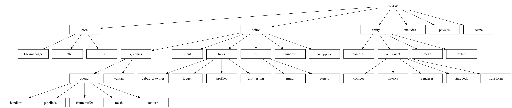

## Physicat Engine

### Build Status (non-compilable)
> Implementing multi-threading which involves `main, render and physics thread` to 
> handle different game states (produced & consumed).
> This involves decoupling the root engine code base and since it's still ongoing,
> currently build is not possible.

## Compatibility
- [x] Unix Console on Mac
- [x] Mac (x84) (Rosetta)
- [ ] Windows
- [x] Web

## Plan of action
- [x] Setting up project for cross-platform build support
- [x] Import mesh/textures
- [x] Rendering in a scene
- [x] Keyboard & Mouse inputs
- [x] Window resize
- [x] Importing c# written fluid-simulation in this engine
- [x] Migrating 2D spatial hashing
- [x] Shader pipeline
- [x] Support for mac
- [x] Find a way to debug coding after built application
- [x] Add Proper logging & profiler system
- [x] Create Basic UI elements like a button and text
- [x] Documentation & UML Diagrams
- [x] Auto UML Creator tool
- [x] Implement ECS
- [x] Add physics library (jolt / physx / box2d / bullet3) -> physx
- [x] Add FPS Counter
- [x] Implementing PhysX (left handed or right handed)
- [x] Multithreading for rendering and update loop
- [x] Thread for Physics
- [x] Adding reflections for dynamic UI
- [x] Adding property changes to track UI updates
- [x] Creating objects in runtime (on start/end of main thread)
- [ ] Bringing back VSync & Delta Time Calculations
- [ ] Creating library for performing maths functions
- [ ] Reworking camera system and merging rotations with other objects in game using new custom math library
- [ ] Implement Tracy throughout engine especially for tracking memory allocations
- [ ] Basic simulation tests
- [ ] Able to see physics colliders
- [ ] Break....... Rejuvenating
- [ ] Updating bash files for supporting physx on mac and web builds
- [ ] Creating vehicle using PhysX
- [ ] Position, Scale, Rotation handles after selecting objects
- [ ] Add Unit Testing
- [ ] Creating wrapper for switching between different physics engine
- [ ] If simple, add basic light and sky box 
- [ ] Improving current shader pipeline to handle shaders dynamically
- [ ] Create Unique ID generator for items
- [ ] Documenting done items and different approaches and used libraries
- [ ] Researching on auto-build deployment and build status
- [ ] On repo update - auto build emscripten for web and upload
- [ ] Creating support for multi-scene compilation
- [ ] File Manager (Reading from file paths and avoiding enums)
- [ ] Ability to read/write on file for saving import references (instead of hard-coded enums)
- [ ] Create build modes for debug and release
- [ ] Find a way to isolate and build code while developing simulations
- [ ] HTML navigation multi scenes on demand (async download and load scenes)
- [ ] Support for window
- [ ] Create a template for dump-testing shaders
- [ ] Dynamic Window Layout & save'n'load
- [ ] Simple tool for importing files like textures/meshes
- [ ] Setting up Vulkan
- [ ] Creating 3D spatial hashing (showcase & in-built)

## Folder Structure

## Tools
- Emscripten
- OpenGL ES3
  - Mac: ``OpenGLES/ES2/gl.h``
  - Emscripten: ``GLES2/gl2.h``
- SDL/SDL2 (mac framework) or GLFW
- Imgui
- Tracy Profiler

## Setup
- Run project/console/setup.sh to install packages
- Run project/console/build.sh to build the project (auto runs the executable)
- Run project/emscripten/build.sh to build the project for web
- Run project/macos/setup.sh and run Physicat.xcodeproj and hit play button

## Issue Links to Query
#### If emcc on terminal won't work?
Activate PATH and other environment variables in the current terminal `` $source ./emsdk_env.sh ``

## Shortcuts to note
- https://stackoverflow.com/questions/6780895/visual-studio-parameter-listing-intellisense

## Mini - TODO
- Explore what's happening in internal_ptr script with the templates and internal_ptr thing
- Empty namespaces name declaration & using namespaces vs include headers

## References
- Engine Structure
  - https://isetta.io/blogs/engine-architecture/
  - https://github.com/suldashi/infinitower
  - https://docs.unrealengine.com/4.27/en-US/Basics/DirectoryStructure/
  - https://slaptijack.com/programming/project-structure-for-cpp.html
  - https://github.com/godotengine/godot
- ECS
  - https://austinmorlan.com/posts/entity_component_system/
- Optimization
  - https://jarlowrey.com/blog/game-optimizations
- [Setting up Emscripten](https://emscripten.org/docs/getting_started/Tutorial.html#tutorial)
- [Building for cross platform](https://marcelbraghetto.github.io/a-simple-triangle/2019/03/02/part-01/)
- [Main Update in Emscripten](https://emscripten.org/docs/porting/emscripten-runtime-environment.html)
- [Pimpl Pattern](https://oliora.github.io/2015/12/29/pimpl-and-rule-of-zero.html)
- [SDL Renderer](https://dev.to/noah11012/using-sdl2-2d-accelerated-renderering-1kcb)
- [Ray Marching](https://www.youtube.com/watch?v=BNZtUB7yhX4)
- Fluid
  - https://magnum.graphics/showcase/fluidsimulation2d/
  - https://github.com/PavelDoGreat/WebGL-Fluid-Simulation
  - https://google.github.io/liquidfun/
- [Shaders](https://www.shadertoy.com)
- Collision Querying
  - [There's gold mine in the comment's research on it](https://www.youtube.com/watch?v=sx4IIQL0x7c&list=RDCMUCEwhtpXrg5MmwlH04ANpL8A&start_radio=1&rv=sx4IIQL0x7c&t=1134)
- [Basic's of c++ to make sure, code is written the right way](https://www.programiz.com/cpp-programming/memory-management)
- [Matrices](https://www.opengl-tutorial.org/beginners-tutorials/tutorial-3-matrices/)

## Documentation & Questions notes

> [!CAUTION]
> - test.
> - test 2 [^2].

- What are macros
- When are macros compiled
  - Why use macros?
  - methods cannot be called globally? why?
  - variables can be declared but not reused globally has to be from method? why?
  - What does reflection actually mean? headrd a lot in c# and now while doing multithreading in c++ as well.
  - what is ui binding? - property change emit event listner

- typename... arg and &&...arg && std::forward(args)...
- std::apply
- NUMA architecture & SALSA