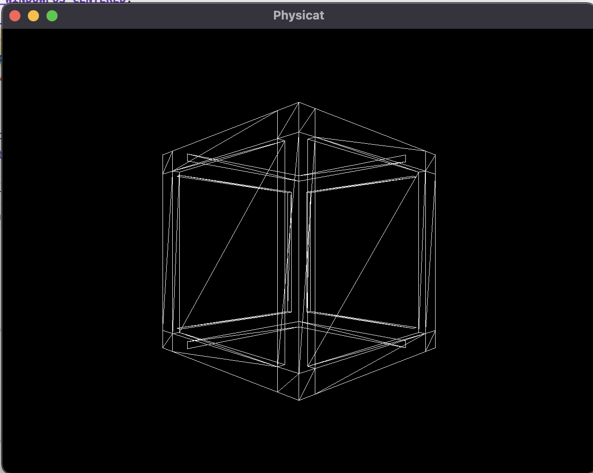

## Plan of action
- [x] Setting up project for cross-platform build support
- [x] Import mesh/textures
- [x] Rendering in a scene
- [ ] Keyboard & Mouse inputs
- [ ] Window resize
- [ ] Simple tool for importing files like textures/meshes
- [x] Importing c# written fluid-simulation in this engine
- [x] Migrating 2D spatial hashing
- [ ] Setting up Vulkan
- [x] Shader pipeline
- [ ] Creating 3D spatial hashing (showcase & in-built)
- [ ] Creating support for multi-scene compilation
- [ ] HTML navigation multi scenes on demand (async download and load scenes)
- [ ] Support for window
- [x] Support for mac
- [x] Find a way to debug coding after built application
- [ ] Find a way to isolate and build code while developing simulations
- [ ] Create build modes for debug and release
- [ ] On repo update - auto build emscriptten for web and upload

## Build

## Compatibility
- [x] Console
- [x] Mac (x84) (Arm architecture not Supported)
- [ ] Windows
- [x] Web

## Tools
- Emscriptten
- Vulkan
- OpenGL ES3
- SDL/SDL2 (mac framework) or GLFW

## References
- [Setting up Emscripten](https://emscripten.org/docs/getting_started/Tutorial.html#tutorial)
- [Building for cross platform](https://marcelbraghetto.github.io/a-simple-triangle/2019/03/02/part-01/)
- [Main Update in Emscripten](https://emscripten.org/docs/porting/emscripten-runtime-environment.html)
- [Pimpl Pattern](https://oliora.github.io/2015/12/29/pimpl-and-rule-of-zero.html)
- [SDL Renderer](https://dev.to/noah11012/using-sdl2-2d-accelerated-renderering-1kcb)
- [Ray Marching](https://www.youtube.com/watch?v=BNZtUB7yhX4)
- Fluid
  - https://magnum.graphics/showcase/fluidsimulation2d/
  - https://github.com/PavelDoGreat/WebGL-Fluid-Simulation
  - https://google.github.io/liquidfun/
- [Shaders](https://www.shadertoy.com)
- Collision Querying
  - [There's gold mine in the comment's research on it](https://www.youtube.com/watch?v=sx4IIQL0x7c&list=RDCMUCEwhtpXrg5MmwlH04ANpL8A&start_radio=1&rv=sx4IIQL0x7c&t=1134)
- [Basic's of c++ to make sure, code is written the right way](https://www.programiz.com/cpp-programming/memory-management)
- [Matrices](https://www.opengl-tutorial.org/beginners-tutorials/tutorial-3-matrices/)

## Setup
- Run project/console/setup.sh to install packages
- Run project/console/build.sh to build the project (auto runs the executable)
- Run project/emscripten/build.sh to build the project for web
- Run project/macos/setup.sh and run Physicat.xcodeproj and hit play button

## Issue Links to Query
#### If emcc on terminal won't work?
Activate PATH and other environment variables in the current terminal `` $source ./emsdk_env.sh ``

## Shortcuts to note
- https://stackoverflow.com/questions/6780895/visual-studio-parameter-listing-intellisense

## Mini - TODO
- Find a way to shutdown the http.server python after running web build
- Explore what's happening in internal_ptr script with the templates and internal_ptr thing
- Empty namespaces name declaration & using namespaces vs include headers
